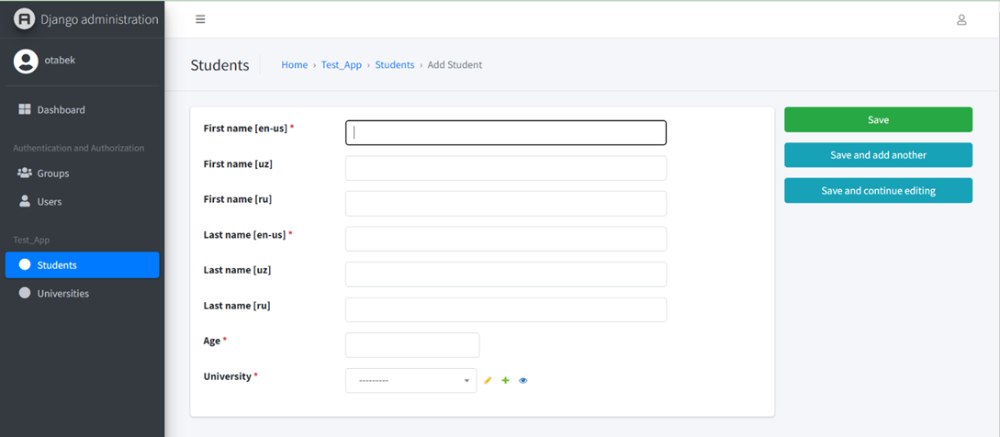
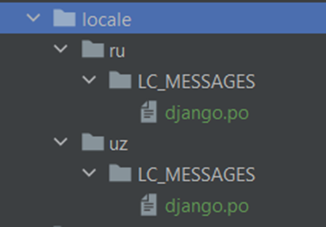
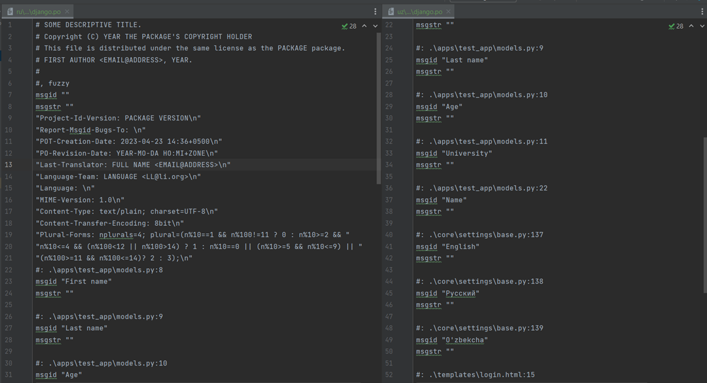
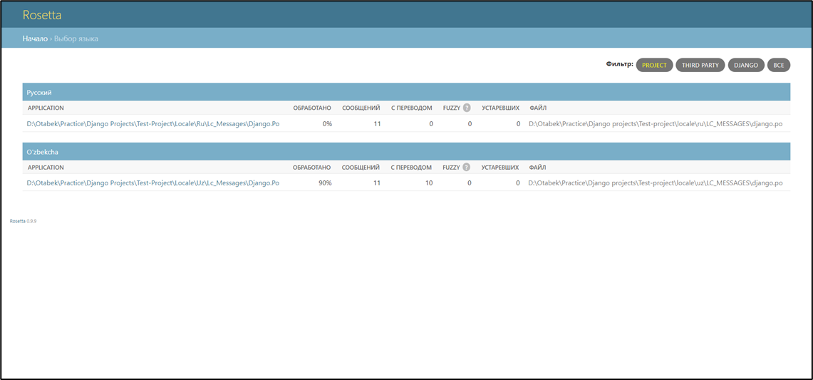

# Djangoda modellarni tarjima qilish uchun qo`llanma

**1. Modeltranslation paketini o'rnatib, loyihamizga qo'shamiz.**  <br />
&emsp;1.1. Terminalga quyidagi buyruqni yozamiz: <br />
&emsp;&emsp;```pip install django-modeltranslation```  <br />
&emsp;1.2. ```'modeltranslation'``` ni ```settings.py``` faylidagi ```INSTALLED_APPS``` ga qo`shamiz: <br />

```python
INSTALLED_APPS = (
    ...
    'modeltranslation',
    'django.contrib.admin',  # optional
    ....
)
```
**2. ```settings.py``` faylida quyidagi sozlamalarni to'g'irlashimiz kerak.**<br />
&emsp;2.1. ```USE_I18N``` ni  ```True``` qilishimiz kerak:
```python
USE_I18N = True
```
&emsp; 2.2. ```gettext_lazy``` va ```os``` ni import qilishimiz kerak:
```python
import os
from django.utils.translation import gettext_lazy as _
```
&emsp; 2.3. ```settings.py``` faylidagi ```Middleware``` lar ro'yhatiga quyidagi middleware ni qo'shamiz:
```python
MIDDLEWARE = [
    "django.contrib.sessions.middleware.SessionMiddleware",
    "django.middleware.locale.LocaleMiddleware", # new
    "django.middleware.common.CommonMiddleware",
]
```
&emsp; 2.4. Faylning quyi qismiga quyidagi sozlamalarni qo`shamiz:
```python 
LANGUAGES = (
    ("en-us", _("English")),
    ("ru", _("Русский")),
    ("uz", _("O'zbekcha")),
)

LOCALE_PATHS = (os.path.join(BASE_DIR, "locale"),)

MODELTRANSLATION_DEFAULT_LANGUAGE = "en-us"
MODELTRANSLATION_LANGUAGES = ("en-us", "uz", "ru")
MODELTRANSLATION_FALLBACK_LANGUAGES = ("en-us", "uz", "ru")
```
**3. ```urls.py``` fayliga quyidagilarni qo`shamiz.**<br />
```python
from django.urls import path, include
from django.conf.urls.i18n import i18n_patterns

urlpatterns = [
    ...
    path("i18n/", include("django.conf.urls.i18n")),
    ...
]

urlpatterns += i18n_patterns(path("admin/", admin.site.urls))
```
**4. O'zimizga kerakli modellarni yozib olamiz.**<br/>
&emsp; ```models.py``` fayliga yozgan modellarimiz:
```python
from django.db import models
from apps.common.models import TimeStampedModel


class Student(TimeStampedModel):
    first_name = models.CharField('First name', max_length=150)
    last_name = models.CharField('Last name', max_length=150)
    age = models.PositiveIntegerField('Age')
    university = models.ForeignKey('test_app.University',on_delete=models.CASCADE,  
                                    verbose_name='University')

    def __str__(self):
        return f"{self.first_name} {self.last_name}"

    class Meta:
        verbose_name = 'Student'
        verbose_name_plural = 'Students'


class University(TimeStampedModel):
    name = models.CharField('Name', max_length=150)

    def __str__(self):
        return self.name

    class Meta:
        verbose_name = 'University'
        verbose_name_plural = 'Universities'
```
**5. Modellarimizni tarjima qilishni boshlaymiz.**<br/>
&emsp; 5.1. ```models.py``` faylimiz joylashgan papkada ```translation.py``` faylini yaratamiz.<br/>
&emsp; 5.2. ```translation.py``` fayligi quyidagilarni import qilib, tarjima bo'lishi kerak bo'lgan maydonlarni yozib chiqamiz. Modellarni bir-biriga bog'lovchi maydonlar (```ForeignKey```, ```OneToOneField```, ```ManyToManyField```) dan boshqa hamma maydonlarni ko'p tilli qilishimiz mumkin.
```python
from modeltranslation.translator import TranslationOptions, register
from .models import Student, University


@register(Student)
class StudentTranslationOptions(TranslationOptions):
    fields = ("first_name", "last_name")


@register(University)
class UniversityTranslationOptions(TranslationOptions):
    fields = ("name",)
```
**6. Admin panelda ortiqcha bo'lgan maydonni olib tashlash uchun quyidagi kodni ```admin.py``` fayliga qo`shamiz.**<br/>
```python
from django.contrib import admin
from modeltranslation.admin import TranslationAdmin

from .models import University, Student


@admin.register(Student)
class StudentModelAdmin(TranslationAdmin):
    list_display = ("id", "first_name", "last_name", "age")
    list_display_links = ("id", "first_name", "last_name", )


@admin.register(University)
class UniversityModelAdmin(TranslationAdmin):
    list_display = ("id", "name")
    list_display_links = ("id", "name")
```
**7. Admin panelni ham ko'p tilli bo'lishi uchun ```models.py``` dagi ```verbose_name``` larni ham tarjima qilish uchun ```models.py``` faylini quyidagicha o`zgartiramiz.**<br />
```python
from django.db import models
from django.utils.translation import gettext_lazy as _

from apps.common.models import TimeStampedModel


class Student(TimeStampedModel):
    first_name = models.CharField(_('First name'), max_length=150)
    last_name = models.CharField(_('Last name'), max_length=150)
    age = models.PositiveIntegerField(_('Age'))
    university = models.ForeignKey('test_app.University', 
					on_delete=models.CASCADE, 
					verbose_name=_('University'))

    def __str__(self):
        return f"{self.first_name} {self.last_name}"

    class Meta:
        verbose_name = 'Student'
        verbose_name_plural = 'Students'


class University(TimeStampedModel):
    name = models.CharField(_('Name'), max_length=150)

    def __str__(self):
        return self.name

    class Meta:
        verbose_name = 'University'
        verbose_name_plural = 'Universities'
```
**8. Endi terminalda quyidagilarni bajaramiz.**<br/>
&emsp; ```python manage.py makemigrations```<br/>
&emsp; ```python manage.py migrate```<br/>
&emsp; Endi ma'lumotlarni 3 xil tilda kiritishimiz mumkin:
&emsp; 
**9. Admin panelni ham o'zgartirish uchun terminalda quyidagilarni bajaramiz**<br/>
&emsp; ```python manage.py makemessages -l uz --ignore=venv```<br/>
&emsp; ```python manage.py makemessages -l ru --ignore=venv```<br/>
**10. Yuqoridegi buyruqlar bizga quyidagi fayllarni yaratib beradi.**<br/>
&emsp;   
**11. Endi shu faylarni ochib so'zlarning mos tarjimalarini yozib chiqamiz.**<br/>
&emsp; 
**12. Tarjimalarni yozib bo'lganimizdan so'ng terminalda quyidagi buyruqni bajaramiz.**<br/>
&emsp; ```python manage.py compilemessages```<br/>
**13. Endi loyihaga ```rosetta``` ni qo'shamiz. Rosettaning vazifasi ```django.po``` fayllarini vizual ko'rinishda ko'rib, tahrir qilishni ta'minlaydi. ```Rosetta``` ni qo'shish uchun quyidagi ishlarni bajaramiz.**<br/>
&emsp; 13.1. Rosettani o'rnatish uchun terminalda quyidagi buyruqni bajaramiz: <br/>
&emsp; &emsp; ```pip install django-rosetta``` <br/>
&emsp; 13.2. ```'rosetta'``` ni ```settings.py``` faylidagi ```INSTALLED_APPS``` ga qo'shamiz. <br/>
&emsp; 13.3. ```urls.py``` fayliga ham quyidagi kodlarni qo'shamiz.
```python
from django.conf import settings
from django.conf.urls import include, re_path

urlpatterns += [
    re_path(r'^rosetta/', include('rosetta.urls'))
]
```
**14. Ana endi, shu ```http://127.0.0.1:8000/rosetta/files/project/```  url manziliga o`tib ```django.po``` fayllarini vizual tarzda ko'rib, tahrir qilishimiz mumkin.** 
&emsp; 